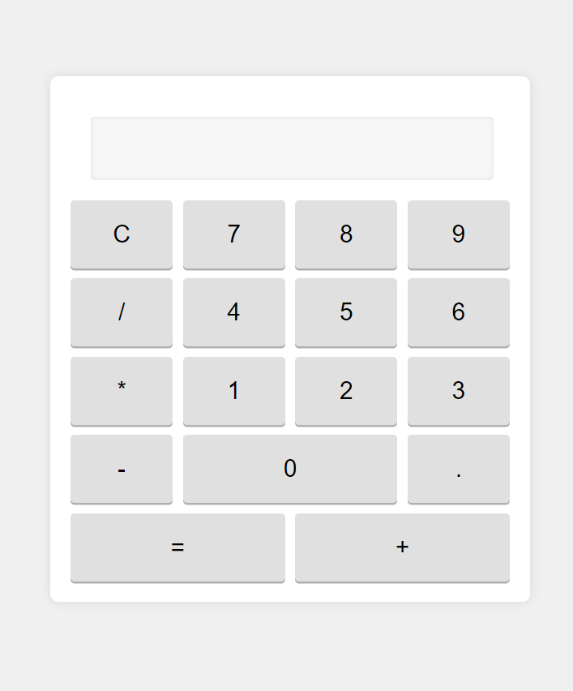

# Calculator

A simple web-based calculator built using HTML, CSS, and JavaScript.

## Demo

You can see a live demo of the calculator [here](https://rajendraprasath307.github.io/JavaScript_calculator/).

## Features

- Basic arithmetic operations: addition, subtraction, multiplication, and division.
- Clear button to reset the display.
- Responsive design for different screen sizes.
- Enlarged input box for better readability.
- Improved button layout for ease of use.

## Screenshots

## Technologies Used

- **HTML**: Structure of the calculator.
- **CSS**: Styling and layout of the calculator.
- **JavaScript**: Functionality and interactivity.

### Summary

This `README.md` provides a comprehensive overview of your project, including:
- A brief description and features list.
- Instructions for viewing a live demo and installing the project locally.
- Details on how to use the calculator.
- An overview of the code structure with specific mentions of recent changes.
- Information on contributing and licensing.

Make sure to replace `./Screenshot 2024-05-22 151128.png` with the actual path to your screenshot and update the demo link if you have a live version hosted somewhere. This will make your README more informative and helpful to users and contributors.
